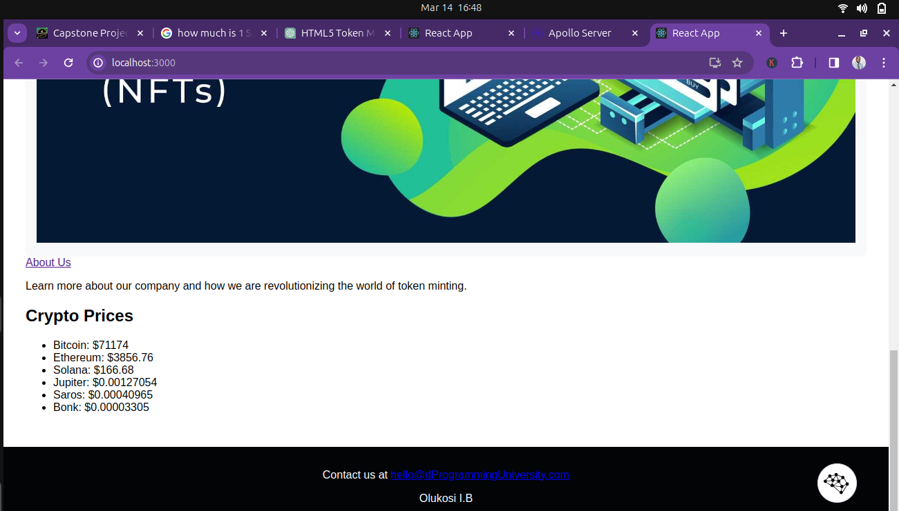
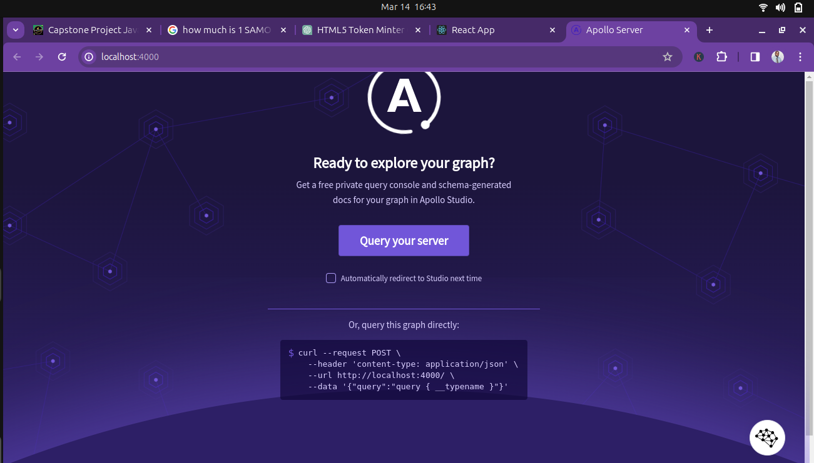
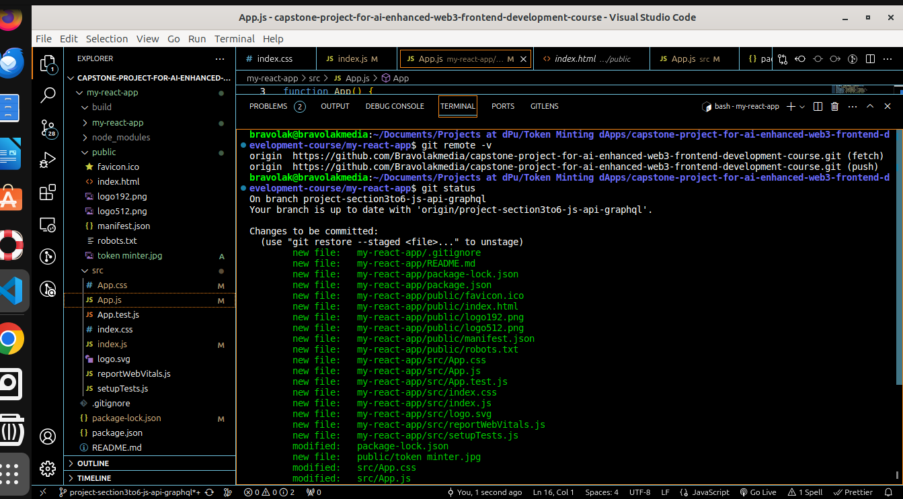
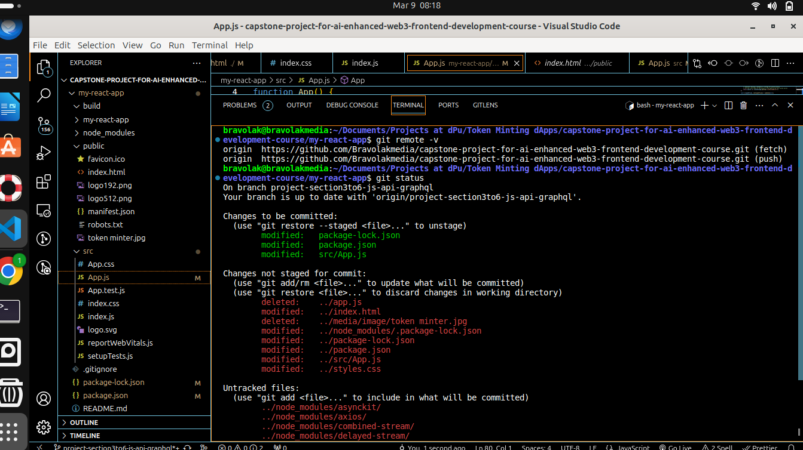
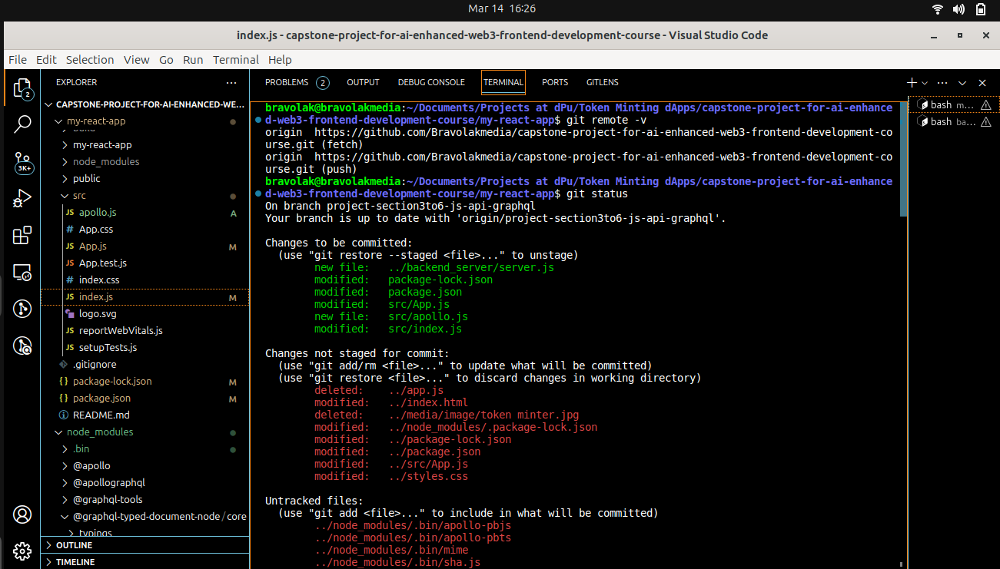
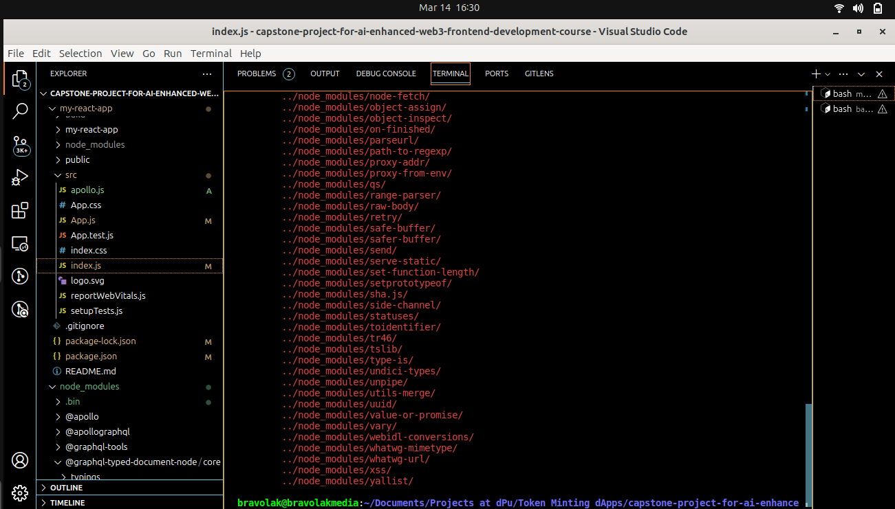

# Capstone Project For AI-enhanced Web3 Frontend Development Course
Welcome to the Capstone Project for the AI-Enhanced Web3 Frontend Development Course at dProgramming University. 

This is frontend project for creating a token minting dApp. The project was done and submitted for approval by :
Olukosi Ismaila Bamidele.

## MY EXPERIENCE:

### SECTION 1 - HTML:

1. I learnt about HTML element tags and how to use them.
2. I learnt about how to implement AI to enhance website design and dApp interphase.
3. I also learnt how to implement HTML5 best practices.
4. My Challenge: I have no challenges in the course as I followed the course and use AI assistance.

## MY EXPERIENCE:

### SECTION 2 - CSS:

1. I learnt about CSS styling like inline, external, text and font styling.
2. I learnt about CSS syntax, selectors, combinators and variables.
3. I learnt about how to use CSS flex box for responsive designs.
4. I learnt about how to use AI in implementing CSS styling of website and dApps.
5. I learnt about CSS libraries/frameworks like Boostrap and Tailwind.
6. Challenges: I used chatGPT to create my stylesheet for the Token Minter dApp and discovered that despite the footer section text having white color, one text in the section is coloured purple. 
 Another challenge is the implementation of changing one text in the footer section to change from purple to pink when displaying Token Minter dApp on Android phones. 
 Both challenges were resolved by prompting with ChatGPT.
 ## MY EXPERIENCE:

### SECTION 3 - JavaScript:

1. I learnt about JavaScript data types like string, boolean, interger and float.
2. I learnt about JavaScript variables, conditionals and loops.
3. I learnt about how to use functions and scopes in JavaScript.
4. I learnt about how to manipulate DOM and handle effects using JavaScript.
5. I learnt about asynchronous programming and use of promise in JavaScript.
6. I learnt about Arrays, objects and JSON.

### SECTION 4 - API Crash Course:

1. I learnt about JavaScript API types e.g REST API.
2. I learnt about fetching data using API.

### SECTION 5 - GraphQL Crash Course:

1. I learnt about how to create a GraphQL server.
2. I learnt about how GraphQL is more specific in data fetching than REST API .
3. I learnt about how to wrap an existing REST API in GraphQL.
4. I learnt about how to integrate your frontend with your GraphQL as backend.

### SECTION 6 - JavaScript Frameworks and Best Practices:

1. I learnt about JavaScript Frameworks like React JS and others.
2. I learnt about JavaScript variables and need to avoid declaring it global for good coding experience.
3. I learnt about how to console.log and other debugging practices.
4. I learnt about the general best practice for clean coding in JavaScript.
5. Challenges: I faced serious challenges doing my Capstone project for JavaScript, API and GraphQL. Each of them post different levels of challenges, starting from implementing React JS. My Token Minter dApp was responding to different media frames, toggling between normal and dark-mode before I implemented React JS which scattered my work. I spent several days to debug and correct the dApp. The same experience happened with API and GraphQL but I overcame the challenges with proper prompting of my ChatGPT.

 ## MY WORKPLACE IMAGES:
- 
- 
- 
- 
- 
- 
